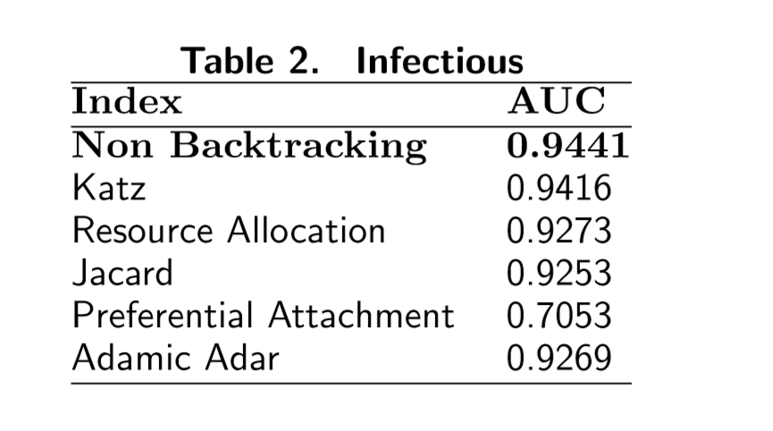
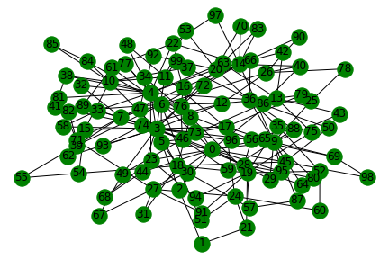
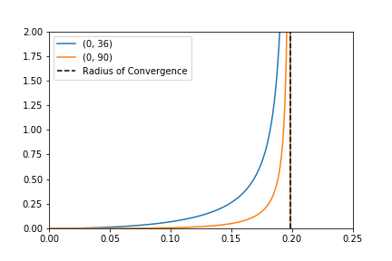

# Non-backtracking walks for link prediction 
## The code from my masters mini-project on a new method for link prediction.
### Abstract 
With the explosion of network data, link prediction has become a fruitful area of research in numerous domains. In particular, link prediction may be applied to large biological, social and economic networks in order to glean new insight into the complex interactions between agents. Further, our ability to predict new interactions is deeply connected to our understanding of how networks evolve. Multiple strategies, both local and global, have been suggested for evaluating the likelihood of a new link. Here we propose a novel metric, the Non-Backtracking Index, based on the theory of nonbacktracking walks. We first give proof of concept by applying the index to some simple toy networks and then proceed to evaluate performance on three real-world networks, highlighting the comparative advantage of the index over the current methods.

